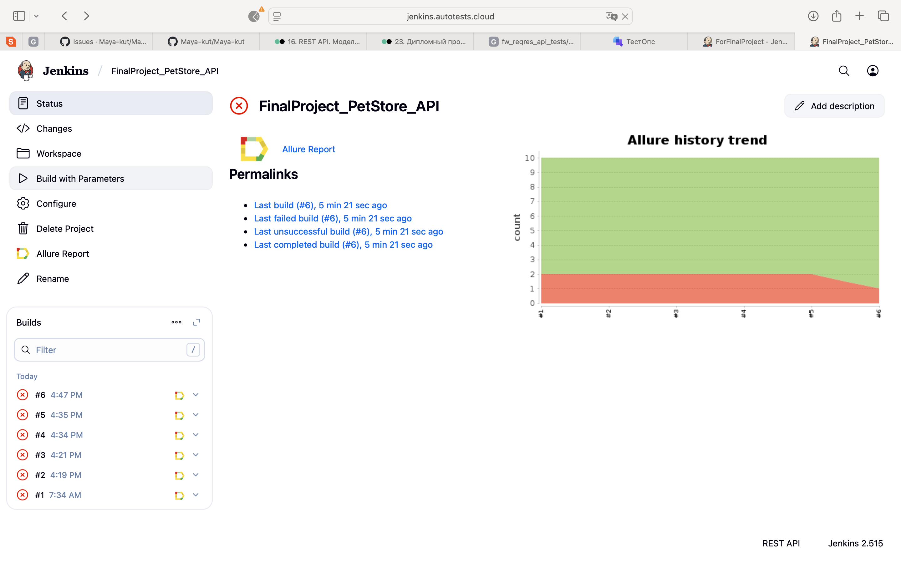
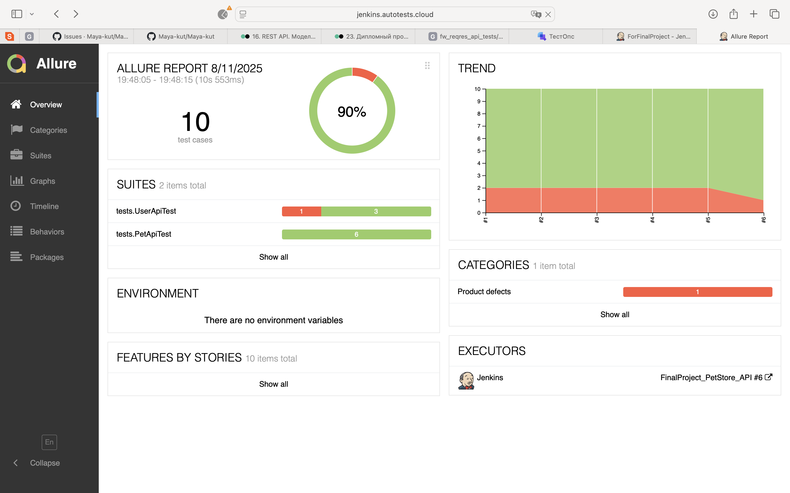
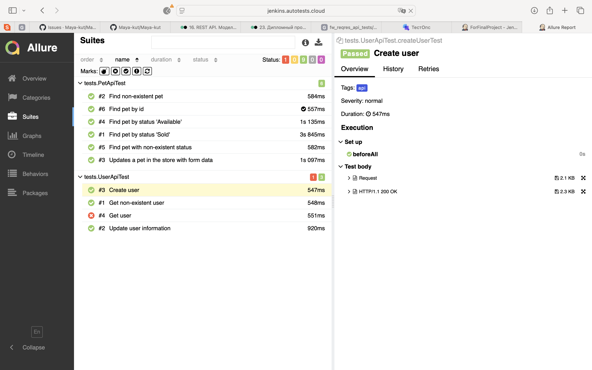

# Проект по автоматизации тестирования API для сайта [Swagger Petstore](https://petstore.swagger.io/#/)

> Petstore OpenAPI - это пример реализации спецификации OpenAPI (ранее Swagger), используемый для демонстрации и
> тестирования инструментов, связанных с OpenAPI. Он представляет собой описание REST API для "магазина домашних
> животных", в котором можно создавать, просматривать, обновлять и удалять информацию о животных, клиентах и заказах.

## Содержание:

- [Технологии и инструменты](#tools)
- [Выполняемые проверки](#cases)
- [Запуск тестов в Jenkins](#remoterun)
- [Allure отчёт](#report)
- [Уведомления в Telegram](#telegram)

## Технологии и инструменты:

  

  

  

Автотесты для данного проекта написаны на <code>Java</code> с использованием библиотеки <code>REST-assured</code> для
взаимодействия с REST api.

В качестве фреймворка для запуска тестов используется <code>Junit5</code>, а в качестве сборщика проекта - <code>
Gradle</code>. Произведена настройка CI в <code>Jenkins</code>.

По результатам каждого тестового прогона создаётся <code>Allure</code> отчёт для визуализации результатов прогона.

Для тест-менеджмента настроена интеграция с <code>Allure TestOps</code>, которая, в свою очередь, интегрирована с
таск-трекером <code>Jira</code>

После прогона тестов <code>Telegram</code> бот присылает сообщение с информацией о прошедшем прогоне

## Выполняемые проверки:

### Взаимодействие со списком пользователей:

✅ Получение данных о пользователе

✅ Получение данных о несуществующем пользователе

✅ Обновление данных пользователя

✅ Создание пользователя

### Взаимодействие со списком питомцев:

✅ Поиск питомца по статусу "Продан"

✅ Поиск питомца по статусу "Доступен"

✅ Поиск питомца по несуществующему статусу

✅ Поиск питомца по идентификатору

✅ Поиск несуществующего питомца

✅ Поиск несуществующего питомца

✅ Обновление данных о питомце

## Запуск тестов в [Jenkins](https://jenkins.autotests.cloud/job/FinalProject_PetStore_API/)

Для запуска тестов в Jenkins нужно нажать на кнопку Build With Parameters в соответствующей сборке

## [Allure отчёт](https://jenkins.autotests.cloud/job/FinalProject_PetStore_API/1/allure/)

### Графики

### Тесты

## Уведомление в Telegram

По результатам каждого прогона тестов в Jenkins отправляется сообщение в Telegram. Сообщение содержит информацию о
прогоне, а также диаграмму со статистикой прохождения тестов.

